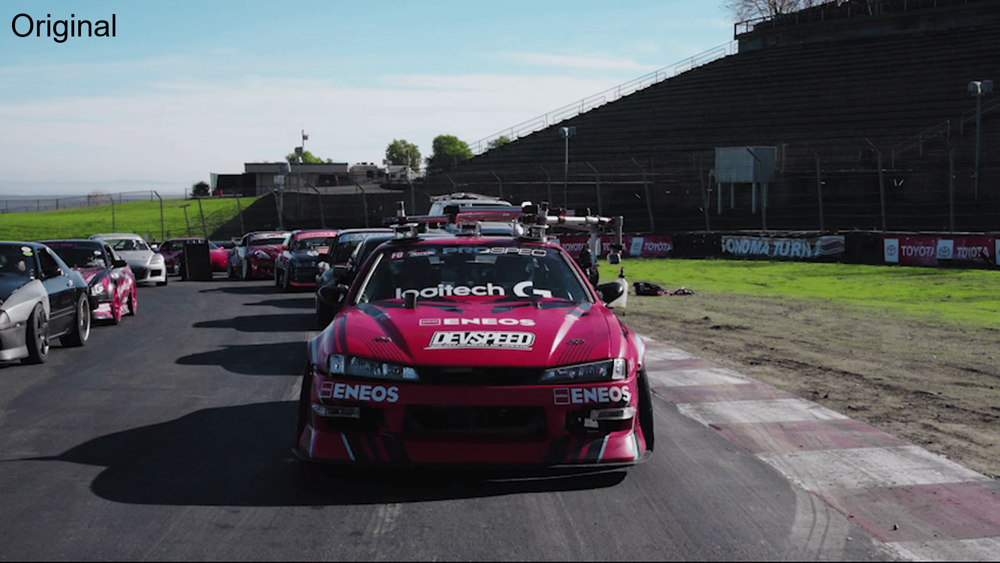

NVIDIA VFX SDK Samples
======================

Overview
--------

The NVIDIA Video Effects SDK (VFX SDK) is a comprehensive collection of AI-powered video effects for real-time video enhancement and processing.

The VFX SDK enables developers to build state-of-the-art video processing applications with AI-powered features, such as video relighting, video super resolution, and AI green screen. The SDK is powered by NVIDIA graphics processing units (GPUs) with Tensor Cores, supporting high throughput and low latency processing.

This repository contains lightweight sample applications showcasing VFX SDK features. The applications process real-time webcam or video streams via the SDK, with processing varying by application. The source code demonstrates SDK usage.

<p align="center">

 </p>

<p align="center">

<br/>
<em>Video Relighting - Top-left: Original, Top-right: Studio Neon Light, Bottom-left: Outdoors Daytime, Bottom-right: Outdoors Nighttime</em>
</p>


Requirements
------------

Refer to the [Get Started on Windows](https://docs.nvidia.com/maxine/vfx/latest/WindowsVFXSDK/GetStartedonWindows.html)
and [Get Started on Linux](https://docs.nvidia.com/maxine/vfx/latest/LinuxVFXSDK/GetStartedonLinux.html) sections of the
[VFX SDK Documentation](https://docs.nvidia.com/maxine/vfx/index.html) for the list of supported GPUs, operating systems, and NVIDIA graphics driver versions.

Setup
-----

### Prerequisites

In order to access and compile the sample applications, the following prerequisites must be installed:

- Git: https://git-scm.com/install/
- Git LFS: https://github.com/git-lfs/git-lfs#installing
- CMake v3.21 or later: https://cmake.org/download/

#### Windows

- Microsoft Visual Studio 2022 (MSVC17.0) or later: https://visualstudio.microsoft.com/downloads/
  - Ensure the **Desktop development with C++** workload is selected and installed

### NVIDIA VFX SDK

In order to build and run the sample applications, the NVIDIA VFX SDK must be installed.

The VFX SDK is comprised of the SDK Core and a set of optional features that can be downloaded and installed individually.
The SDK Core and features are distributed through the NVIDIA GPU Cloud (NGC) platform.

The SDK Core includes the API headers, library files, and runtime dependencies. It does not include the libraries
and models that are required to run any of the features. Once installed, the SDK Core provides a script to fetch and
install features from NGC.

To install the SDK Core and features, navigate to the [VFX SDK Documentation](https://docs.nvidia.com/maxine/vfx/index.html)
and follow the installation instructions for [Windows](https://docs.nvidia.com/maxine/vfx/latest/WindowsVFXSDK/InstalltheVFXSDK.html)
or [Linux](https://docs.nvidia.com/maxine/vfx/latest/LinuxVFXSDK/InstalltheVFXSDK.html).

#### VFX SDK Features

Each sample application requires a particular set of VFX SDK features to be installed. See the README.md file in each
sample application directory for details of the features required for that application.

### Accessing the sample code

Clone using git:
  - `git clone git@github.com:NVIDIA-Maxine/VFX-SDK-Samples.git`
  - `cd VFX-SDK-Samples`

Initialize git-lfs:
  - `git lfs install`
  - `git lfs pull`

Building and running
--------------------

By default, CMake will build all sample applications whose required features are installed.
Any sample application that does not have all of its required features installed will be skipped.

**Note:** Some sample applications have additional requirements beyond those mentioned here.
See the README.md in each individual application directory for specific requirements.

### Build applications - Windows - Command prompt

In a Visual Studio 2022 Developer Command Prompt:

```
cd VFX-SDK-Samples
cmake.exe -S . -B build -G "Visual Studio 17 2022" -DVFXSDK_ROOT=</path/to/VFX_SDK>
cmake.exe --build build --config Release
```

Replace `</path/to/VFX_SDK>` with the root path of your VFX SDK installation.

### Run applications - Windows - Command prompt

To run the sample applications, use the provided wrapper scripts `run_<app name>_<mode>.bat`, which set required
environment variables and run the application.

For example, to run AigsEffectApp with webcam input, built in Release configuration:

```
cd build\apps\AigsEffectApp\Release
run_aigseffectapp_webcam.bat
```

### Build applications - Windows - GUI

1. From Windows Start menu, open CMake GUI
   - In "Where is the source code:" select the path to VFX-SDK-Samples
   - In "Where to build the binaries:" select the path to VFX-SDK-Samples/build
2. Click "Configure"
3. Set the variable `VFXSDK_ROOT` to the location where the VFX SDK is installed
4. Click "Configure" again
5. Click "Generate"
6. Click "Open Project" to open the generated solution file in Visual Studio
7. In Visual Studio: *Build -> Build Solution*, (or **Ctrl+Shift+B**)

### Run applications - Windows - GUI

For example, to run AigsEffectApp:

1. Right click **AigsEffectApp** in the Solution Explorer of Visual Studio
2. Set as Startup Project
3. Run **Local Windows Debugger** 


### Build applications - Linux - Terminal

For convenience, use the script `build_samples.sh` to install required dependencies and build all sample applications.
The script should not be run as root; it will prompt for elevated privileges to install dependencies, if necessary.
The script will also prompt for the desired location to build the sample applications, which is set to `~/mysamples` by default.

```
cd VFX-SDK-Samples
./build_samples.sh
```

### Run applications - Linux - Terminal

To run the sample applications, use the provided wrapper scripts `run_<app name>_<mode>.sh`, which set required
environment variables and run the application.

For example, to run AigsEffectApp with webcam input, built in the default location of `~/mysamples`:

```
cd ~/mysamples/build/apps/AigsEffectApp
run_aigseffectapp_webcam.sh
```


Triton - Linux Only
-------------------

Triton client applications are applications that communicate with an NVIDIA Triton Inference Server allowing off-client inference processing. The Triton backend application comes with the SDK and needs to run in a separate process from the client sample applications in this repository.

To set up the Triton server, follow the instructions on [Triton Installation](https://docs.nvidia.com/maxine/triton/latest/GetStarted/InstallServerandSDK.html)

### Building the Triton Client Applications

To build Triton client applications, pass the flag `-DENABLE_TRITON=ON` to the CMake command during configuration. The flag will be enabled by default when running the `build_samples.sh` script on Linux.

### Run the Triton Server

Before running the sample applications, you must start the
Triton server by running the ``run_triton_server.sh`` script in the server
package. Refer to the [Triton Installation](https://docs.nvidia.com/maxine/triton/latest/GetStarted/InstallServerandSDK.html)
section of the Triton documentation for more details.

### Run the Triton Client Applications

The sample applications need to be run as a separate process from the server. When
running manually, the server and the sample applications can be run
on separate terminals or using utilities such as tmux.

See README.md in each Triton client app directory for details on how to run the corresponding app.

Common Issues
-------------

### App won't start

If the apps cannot find required libraries, they may not run. Please ensure you run the apps using the provided wrapper
scripts, named `run_<app name>_<mode>.bat` (Windows) or `run_<app name>_<mode>.sh` (Linux). These scripts will set up
environment variables required to run the app, and ensure required libraries for the SDK and dependencies can be loaded.

### Missing Feature Installations

If CMake complains with a warning message:
```
Required feature <feature name> is not available.
```
or
```
REQUIRED FEATURE: <feature name> VERSION: <version> is not available.
```
followed by
```
Skipping <app name>.
```
Make sure that the latest version of the feature is installed (see section on Features under Setup).

Note that it is possible to build a subset of the sample apps by installing a subset of all features, say only the ones that are required for the sample app you want to build.

### Missing Git LFS

An error like:

`moov atom not found`, followed by
`Error: Could not open video`, is likely due to OpenCV trying to interpret temporary text files as video. These larger files are maintained using git-lfs, which needs to be installed and initialized in the repository for any of the applications to be able to load the provided sample videos. See the section on **Accessing the sample code** to initialize git-lfs.

### Video codec error

The video codec error message from OpenCV when running the applications in offline mode can be ignored. OpenCV should fall back to the default codec on both Windows and Linux. Some example error messages could be:
"Could not open codec 'libopenh264': Unspecified error"
"OpenCV: FFMPEG: tag 0x34363248/'H264' is not supported with codec id 27 and format 'mp4 / MP4 (MPEG-4 Part 14)'"

Documentation
-------------

Please refer to the online documentation guides
- [NVIDIA VFX SDK User Guide](https://docs.nvidia.com/maxine/vfx/index.html)
- [NVIDIA Triton Inference Guide](https://docs.nvidia.com/maxine/triton/index.html)
- [NvCVImage API Guide](https://docs.nvidia.com/maxine/nvcvimage/index.html)

License
-------

- **Software license** - Refer to [LICENSE](LICENSE)
- **Third party licenses** - Refer to [external/ThirdPartyLicenses.txt](external/ThirdPartyLicenses.txt)
- **Sample data** - Refer to [resources/NVIDIA Sample Data License (2025.10.22).pdf](resources/NVIDIA%20Sample%20Data%20License%20(2025.10.22).pdf)
